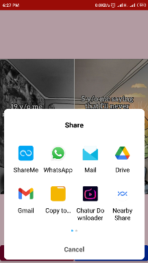

# MeMe-Live
MeMe Live App - A seamless, high-performing App; accessible library for API related tasks .An Application for showing Meme from API Data and Visible in your Activity.

## Features
- Share the Particular Meme
- With the help of **Next** Button find the new Meme.
  
## Libraries
- [Volley Library](https://developer.android.com/training/volley): Called for API Data.
- [Glide Library](https://github.com/bumptech/glide) : For Image Loading Framework

## Support
- Android 6.0+

## Download Now 

- [MeMe Live](https://mega.nz/file/aqpAmTQD#qA09cq5cwGcMSootDiKoYq-gXfy76l_tPoLSvHZzOqc)

## ScreenShots

